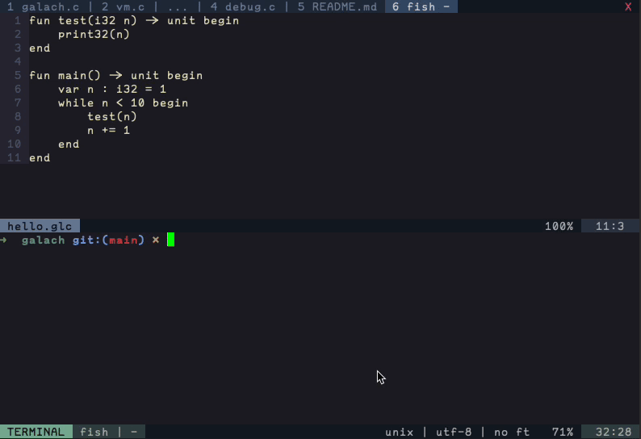

# Galach

The Galach programming language. Made for educational purposes to teach myself about building a compiler.
The code is pretty macro-heavy, as a lot of this is just experimenting; I didn't do a whole lot of research
into how conventional compilers are built, and for the most part I tried figuring it out on my own.  

Galach compiles to bytecode and then runs in a virtual machine. Error messages were designed to be useful
to the person debugging the compiler, not to the person writing the Galach code (likewise with the VM
error messages). A bunch of important features are missing from the language, such as type safety, floating
point arithmetic, and a standard library, among other things. The bytecode is unoptimized, and you can view
it by running `galach` with the `-d` option.  

## Building
Building the compiler is pretty simple. I tried to keep most of the source in C99.  
To build debug, you can build and run with `make run`.
To build the optimized executable, you can build and run with `make MODE=prod run`

